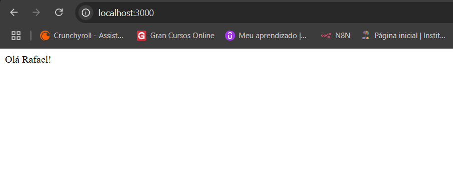

# Minikube application

## Descrição

Cria um cluster do minikube com 4 nodes e instala todos os recursos necessários para a aplicação rodar através do helm.


## 🚀 Pré-requisitos

- Ter o minikube instalado
- Ter o Docker instalado


## ⚙️ Instalação e acesso à aplicação

1. Rodar o comando abaixo do arquivo Makefile configurado e o cluster será criado o helm chart da aplicação será instalado

```bash
    make cluster
```

2. No navegador acesse **localhost:3000** e a página será exibida




3. Para deletar o ambiente pressione **Ctrl + C** para encerrar o port forward e digite o comando abaixo para excluir o cluster

```bash
    make delete
```

